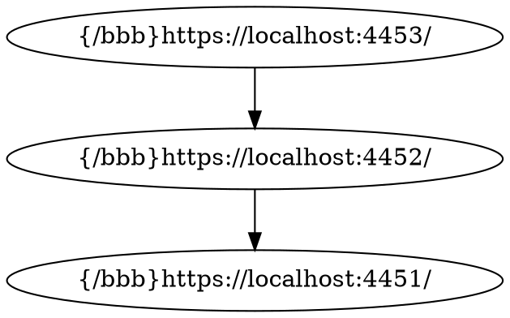

# Topology for `moq-rs`

This project is made with the purpose of implementing an extension in the `moq-api` component of the original [moq-rs](https://github.com/englishm/moq-rs) project. The goal is to build a relay network based on an input topology file.

## How it works

The file must be put in the project root with the name `topo.dot`. Currently other file names are not possible, because I'm using [petgraph](https://github.com/petgraph/petgraph) which supports file importing only statically.

The topology input should look like something like this. For now, graph shouldn't have any splits, but later a metric-based path finding may be implemented.

Replace `/bbb` with your namespace and the urls with the relay's addresses.



## How to test

I have created a bash script to ease testing. The top part of the script contains a few parameters, which you can set as you like:

```bash
# ...

# --- Port Definitions ---
PORT_REDIS=6379
PORT_MOQ_DIR=4444
PORT_MOQ_API=8080
PORT_RELAY1=4451
PORT_RELAY2=4452
PORT_RELAY3=4453
# Publisher will use PORT_RELAY1
# Subscriber will use PORT_RELAY3

# --- File Path Definitions ---
# This path is relative to the 'moq-api' working directory
TOPO_FILE_PATH='../topo.dot'

# ...
```

The ports (obviously) should be the same as in the topology file. Currently `TOPO_FILE_PATH` does not matter, so there is no need to change it. Remember to have a `topo.dot` file in the project root.

Run the script with `./test.sh`.

You may have to install `xterm`.

If everything works correctly, you should see the Big Buck Bunny test video with the terminals running separetly with the given components.

## Metrics collection with Prometheus

There is currently an ongoing development with the goal of integrating Prometheus with the project. Basic metrics are available on `\metrics` in the API server.

# License

Licensed under either:

-   Apache License, Version 2.0, ([LICENSE-APACHE](LICENSE-APACHE) or http://www.apache.org/licenses/LICENSE-2.0)
-   MIT license ([LICENSE-MIT](LICENSE-MIT) or http://opensource.org/licenses/MIT)
